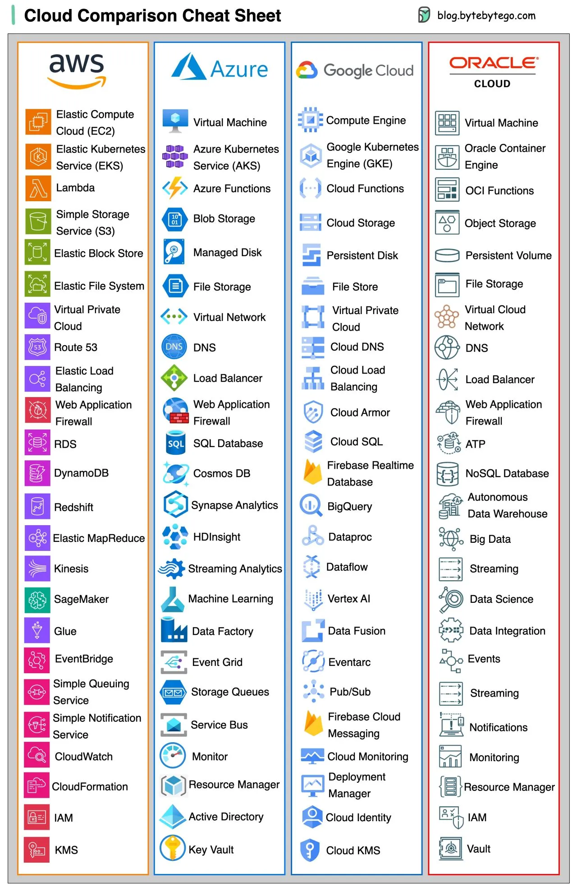
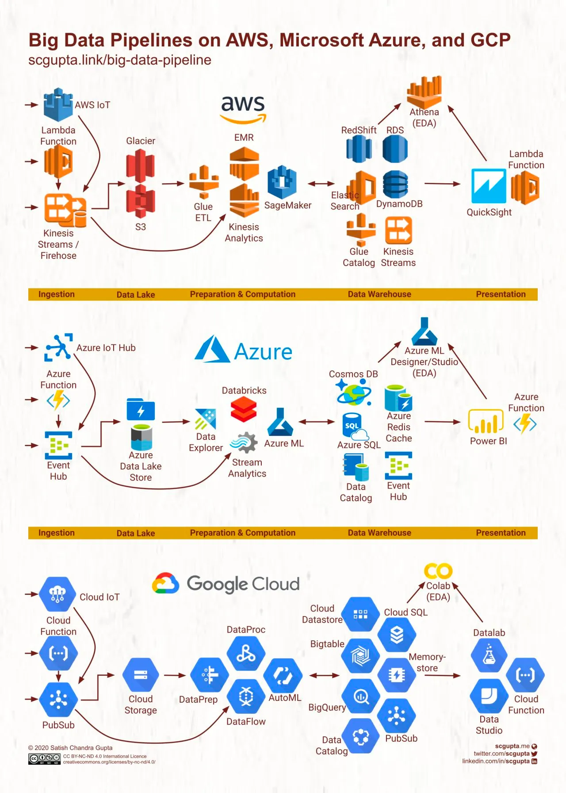

# LESA6

Os grandes provedores de serviços de computação em nuvem (hyper scalers) disponibilizam soluções que vão desde armazenamento e processamento até cumprimento a normas de regulamentação.

Como as soluções atendidas são todas relacionadas a computação, é possível fazer paralelos entre as soluções apresentadas por cada provedor, conforme apontado por Govardhana Miriyala Kannaiah em publicação do blog bytebytego: 
[A nice cheat sheet of different cloud services (2023 edition)](https://blog.bytebytego.com/i/135537446/a-nice-cheat-sheet-of-different-cloud-services-edition)

## Exemplos de serviços utilizados com frequencia por seus diferenciais

Considerando a capacidade de distribuição de computação, os seguinte serviços são utilizados com bastante frequência considerando as vantagens e desvantagens de suas respectivas descriçoes:

### Virtual machine

Com o desenvolvimento de tecnologias de computação em grid abre-se a possibilidade de fracionamento do poder de computação em diferentes configurações. Assim, é possível utilizar instâncias de máquina virtual que rodam sobre a infraestrutura do hyper scaler de acordo com a necessidade de negócio.

Considerando a gama de serviços disponíveis, é uma solução menos flexível e sujeita a custos mais constantes.

### Azure Kubernetes Service (AKS)

Um dos grandes potenciais da nuvem é o emprego de containeres efêmeros (que podem ser criados e destruídos de acordo), por permitir que clusteres de computadores possam ser orquestrados como solução elástica através de tecnologias como kubernetes.

Entretanto, gerenciar os containeres de controle é uma tarefa que exige contratação de profissionais qualificados e escassos no mercado, bem como ter necessidade computacional que justifique a aquisição de tal maquinário para ter disponível uma nuvem privada.

Dessa forma, com a utilização de serviços gerenciados de kubernetes, é possível ter inúmeras aplicações sendo executadas, implantadas e removidas da operação sem necessidade de mudanças significativas na infra estrutura.5

### Azure functions

Abstraindo ainda além do kubernetes, o conceito de servico gerenciado pode ser implementado através da tecnologia Azure Function. Essa tecnologia permite que se defina o poder de processamento, volume de memória e o código em linguagem de programação que a ser executado.

Essa é uma das tecnologias denominadas como serverless, por passar a responsabilidade do gerenciamento de hardware, sistema operacional ou de redes. Assim, o negócio ser preocupará apenas com a lógica a ser implementada.

### Blob Storage

É uma forma de armazenamento em nuvem que permite que diferentes tipos de objetos sejam armazenados. Diferentemente de um banco de dados relacional, os dados são armazenados sequencialmente sem organização de tupla. Esse tipo de organização permite que os objetos sejam recuperados mais rapidamente.

Também são distribuídos entre as zonas de disponibilidade, garantindo a aplicação de redundância para a operação dos serviços, respeitando questões legais e de governança.

Considerando a velocidade de acesso de memória e escalabilidade que os serviços gerenciados podem alcançar, é um forte candidato para leitura e armazenamento de processamentos paralelos.

### Cosmos DB

É um banco de dados NoSql. Diferentemente do Blob Storage, permite que dados sejam acessados sem a necessidade de recuperar o objeto inteiro primeiro. Também é um banco de dados escalável e com orientação à performance para aplicações. A performance do banco é relacionado à indexação dos atributos dos objetos. O armazenamento dos atributos podem ser configurados para melhoria de performance.
Algumas configurações como TTL (Time to live), são boas práticas para melhor controle de custos.

## Exemplo prático de aplicação dos serviços

Tratando sobre exemplos de escalabilidade, propostas de soluções para big data são propícios por apresentarem as seguintes características:
- Grandes volumes de dados de diferentes origens e estruturas
- O processamento precisa ocorrer em determinado período ou continuamente
- O tamanho dos nós de processamento podem exigir arquiteturas que possam escalar horizontalmente ou verticalmente, de acordo com o tipo de situação a ser solucionada

Novamente, trazemos um exemplo comparado do blog bytebytego em que é apresentada a mesma sugestão de solução implementada em diferentes hyper scalers: [Which cloud provider should be used when building a big data solution?](https://blog.bytebytego.com/p/which-cloud-provider-should-be-used)

Dessa forma, abordaremos a possibilidade de implementação de solução no hyper scaler da Microsoft, Azure cloud.
